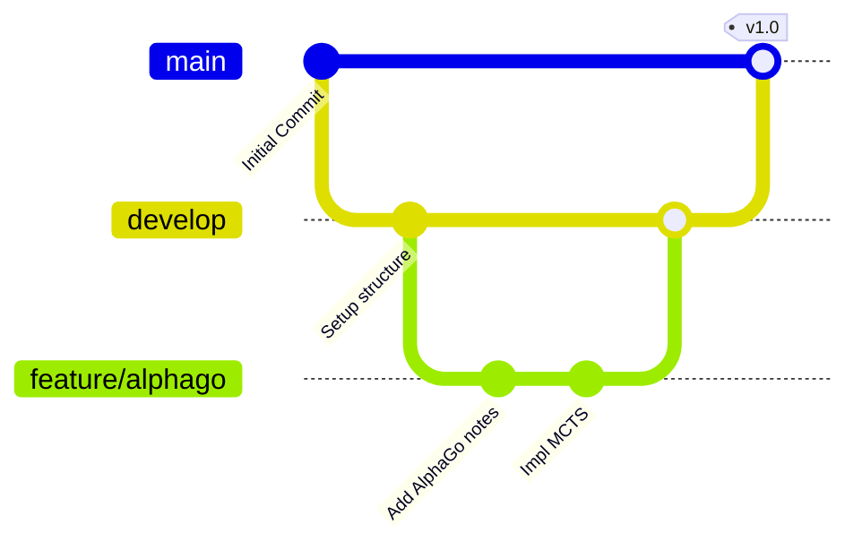

# GitHub Branching Strategy

This document outlines the branching workflow for the AI Search Study project, ensuring a clean separation between stable production code and active development.

## Branches

1.  **`main` (Production)**
    *   Contains stable, tested code.
    *   Deployable state.
    *   **Rule**: No direct commits. Only merge via Pull Requests (PRs) from `develop` or `hotfix`.

2.  **`develop` (Development)**
    *   Integration branch for features.
    *   Contains the latest delivered development changes for the next release.
    *   **Rule**: Merge `feature` branches here.

3.  **`feature/*` (Developer Work)**
    *   Created from: `develop`
    *   Merged back into: `develop`
    *   Naming convention: `feature/paper-name-algorithm` or `feature/add-readme`
    *   **Rule**: One branch per feature/paper.

## Workflow Diagram



## Developer Workflow

1.  **Start a new feature**:
    ```bash
    git checkout develop
    git pull origin develop
    git checkout -b feature/new-paper-implementation
    ```

2.  **Work and Commit**:
    ```bash
    git add .
    git commit -m "Implement search algorithm"
    ```

3.  **Finish feature**:
    *   Push branch to GitHub (`git push origin feature/new-paper-implementation`)
    *   Open a Pull Request (PR) from `feature/...` to `develop`.
    *   Review and Merge.

4.  **Release**:
    *   Merge `develop` to `main` when a milestone is reached.
